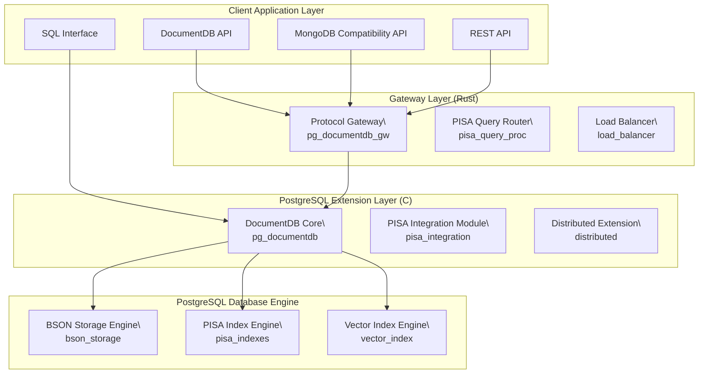

PISA Hybrid Path: In CI builds, the PISA hybrid query path is temporarily disabled via DISABLE_PISA_HYBRID to ensure clean builds. Remove the PG_CPPFLAGS define in pg_documentdb/Makefile to re-enable locally.

# SequoiaDB-aidoc: High-Performance Document Database for PostgreSQL

## Introduction

`SequoiaDB-aidoc` is built on `DocumentDB` — the open-source engine powering vCore-based Azure Cosmos DB for MongoDB. It provides a native implementation of a document-oriented NoSQL database within PostgreSQL, enabling seamless CRUD operations on BSON data types.

[PostgreSQL](https://www.postgresql.org/about/) is a powerful, open-source object-relational database system that uses and extends the SQL language, combined with many features that safely store and scale the most complicated data workloads.

### New Features with PISA Integration

The integration of the PISA engine brings state-of-the-art text search technology to `SequoiaDB-aidoc`:

-   **High-Performance Text Search**: Millisecond-level text search response times using PISA's inverted indexes.
-   **Advanced Query Algorithms**: Support for academic-grade query algorithms like WAND, Block-Max-WAND, and MaxScore.
-   **Intelligent Document Reordering**: Optimizes index compression using recursive graph bisection, saving 40-60% of storage space.
-   **Query Caching System**: Smart LRU/LFU cache mechanism to significantly boost performance for repeated queries.
-   **Distributed Text Search**: Parallel text search processing for large-scale document collections.

## System Architecture

`SequoiaDB-aidoc` consists of several core components working together:



## Core Features

### Original DocumentDB Features
-   **BSON Document Storage**: Native BSON document storage and querying within PostgreSQL.
-   **Aggregation Pipeline**: A comprehensive, self-developed aggregation pipeline.
-   **Vector Search**: Support for HNSW and IVF indexes for vector search.
-   **Geospatial and Full-Text Search**: Powerful built-in search capabilities.
-   **Distributed and High Availability**: Enterprise-grade scalability with sharding.
-   **Background Index Creation**: Non-blocking index creation.
-   **Cursor-Based Pagination**: Efficient handling of large result sets.

### PISA-Enhanced Features
-   **Millisecond Text Search**: Query latency < 50ms, 7-10 times faster than traditional solutions.
-   **Advanced Compression**: Support for various compression algorithms like varintgb, maskedvbyte, and qmx.
-   **Hybrid Search**: Seamless combination of text, vector, and geospatial search.
-   **Real-time Monitoring**: Live monitoring of query latency, memory usage, and cache hit rates.
-   **Automated Optimization**: Scheduled execution for document reordering and index optimization.

## Get Started

### Prerequisites

-   Ensure [Docker](https://docs.docker.com/engine/install/) is installed on your system.
-   Ensure [Git](https://git-scm.com/downloads) is installed on your system.

### Quick Deployment (Recommended)

This method uses an automated script to deploy `SequoiaDB-aidoc` with PISA integration.

**Step 1: Clone the Repository and Checkout the Integration Branch**

```bash
# Clone the repository
git clone https://github.com/microsoft/documentdb.git
cd documentdb

# (Example) Checkout the PISA integration branch
# git checkout devin/1754288697-pisa-integration
```

**Step 2: Run the Automated Deployment Script**

The script handles all dependencies and configuration.

```bash
chmod +x scripts/deploy_pisa_integration.sh

# Run the deployment with default settings
./scripts/deploy_pisa_integration.sh

# For custom options, view the help menu
./scripts/deploy_pisa_integration.sh --help
```

**Step 3: Verify the Installation**

Connect to the database and check if the PISA integration is active.

```bash
# Connect to the newly created database
psql -d documentdb_pisa

# Verify PISA integration status
SELECT documentdb_api.is_pisa_integration_enabled();

# Run a health check
SELECT documentdb_api.pisa_health_check();
```

### Docker Deployment

You can also use Docker to deploy `SequoiaDB-aidoc`, either by using a pre-built image or building from source.

#### Using the Pre-built Image

**Step 1: Pull the PISA-integrated Docker Image**

```bash
# Pull the latest PISA-integrated image
docker pull oxyn-ai/documentdb-pisa:latest
```

**Step 2: Run the Docker Container**
```bash
# For internal access
docker run -dt oxyn-ai/documentdb-pisa:latest

# For external access, mapping ports
docker run -p 127.0.0.1:9712:9712 -p 127.0.0.1:10260:10260 -dt \
  -e PISA_ENABLED=true \
  -e PISA_MAX_MEMORY=2GB \
  oxyn-ai/documentdb-pisa:latest -e
```

#### Building the Image from Source

**Step 1: Clone the Repository**

```bash
git clone https://github.com/microsoft/documentdb.git
cd documentdb
# git checkout <pisa-integration-branch>
```

**Step 2: Build the Docker Image**

```bash
docker build . -f .devcontainer/Dockerfile -t documentdb-pisa
```

**Step 3: Run the Container**

```bash
docker run -v $(pwd):/home/documentdb/code -it documentdb-pisa /bin/bash
cd code
```

**Step 4: Build, Install, and Deploy**

```bash
# Build DocumentDB with PISA integration
make

# Install the binaries
sudo make install

# Start the server
./scripts/start_oss_server.sh
```

### Pure SQL Interface (docsql)

- Install:
  CREATE EXTENSION pg_documentdb;
  CREATE EXTENSION pg_documentdb_docsql;

- Quick start:
  SELECT documentdb_docsql.create_database('demo');
  SELECT documentdb_docsql.create_collection('demo','items');
  INSERT INTO docsql_demo.items(document) VALUES ('{ "_id":"i1","name":"foo" }');
  SELECT (document->>'_id') AS id, (document->>'name') AS name FROM docsql_demo.items ORDER BY id;

- Cleanup:
  SELECT documentdb_docsql.drop_collection('demo','items');
  SELECT documentdb_docsql.drop_database('demo');

### Connecting to the Server

Connect to the PostgreSQL shell to start using `SequoiaDB-aidoc`.

```bash
# If running locally or inside the container
psql -p 9712 -d postgres

# For external access
psql -h localhost --port 9712 -d postgres -U documentdb
```

## Usage Examples

Once `SequoiaDB-aidoc` is running, you can create collections, insert documents, and perform queries. The following examples use a `patient` collection in the `documentdb` database.

### Basic CRUD Operations

#### Create a Collection
```sql
SELECT documentdb_api.create_collection('documentdb','patient');
```

#### Insert Documents
```sql
select documentdb_api.insert_one('documentdb','patient', '{ "patient_id": "P001", "name": "Alice Smith", "age": 30, "phone_number": "555-0123", "registration_year": "2023","conditions": ["Diabetes", "Hypertension"]}');
select documentdb_api.insert_one('documentdb','patient', '{ "patient_id": "P002", "name": "Bob Johnson", "age": 45, "phone_number": "555-0456", "registration_year": "2023", "conditions": ["Asthma"]}');
select documentdb_api.insert_one('documentdb','patient', '{ "patient_id": "P003", "name": "Charlie Brown", "age": 29, "phone_number": "555-0789", "registration_year": "2024", "conditions": ["Allergy", "Anemia"]}');
```

#### Read Documents
To retrieve all documents from the collection:
```sql
SELECT document FROM documentdb_api.collection('documentdb','patient');
```
To query with a filter:
```sql
SET search_path TO documentdb_api, documentdb_core;
SET documentdb_core.bsonUseEJson TO true;

SELECT cursorPage FROM documentdb_api.find_cursor_first_page('documentdb', '{ "find" : "patient", "filter" : {"patient_id":"P001"}}');
```

#### Update a Document
Update the `age` for patient `P003`:
```sql
select documentdb_api.update('documentdb', '{"update":"patient", "updates":[{"q":{"patient_id":"P003"},"u":{"$set":{"age":31}}}]}');
```

#### Delete a Document
Delete the document for patient `P002`:
```sql
SELECT documentdb_api.delete('documentdb', '{"delete": "patient", "deletes": [{"q": {"patient_id": "P002"}, "limit": 1}]}');
```

### Indexing

#### Create an Index
Create a single-field index on `age`:
```sql
SELECT * FROM documentdb_api.create_indexes_background('documentdb', '{ "createIndexes": "patient", "indexes": [{ "key": {"age": 1},"name": "idx_age"}]}');
```
Create a compound index on `registration_year` and `age`:
```sql
SELECT * FROM documentdb_api.create_indexes_background('documentdb', '{ "createIndexes": "patient", "indexes": [{ "key": {"registration_year": 1, "age": 1},"name": "idx_regyr_age"}]}');
```

#### Drop an Index
```sql
CALL documentdb_api.drop_indexes('documentdb', '{"dropIndexes": "patient", "index":"idx_age"}');
```

### Aggregations

Group patients by registration year and count them:
```sql
SELECT cursorpage FROM documentdb_api.aggregate_cursor_first_page('documentdb', '{ "aggregate": "patient", "pipeline": [ { "$group": { "_id": "$registration_year", "count_patients": { "$count": {} } } } ] , "cursor": { "batchSize": 3 } }');
```

### PISA Text Search

Leverage the PISA engine for high-speed text searches.

**Step 1: Create a PISA Text Index**

Before performing a text search, you must create a PISA index on the field you want to search.

```sql
-- Create a test collection and insert a document
SELECT documentdb_api.create_collection('testdb', 'testcol');
SELECT documentdb_api.insert_one('testdb', 'testcol', 
    '{"name": "test", "content": "这是一个测试文档，用于验证PISA文本搜索功能"}');

-- Create a PISA text index on the 'content' field
SELECT documentdb_api.create_pisa_text_index('testdb', 'testcol', 
    '{"content": "text"}', '{"name": "content_pisa_idx"}');
```

**Step 2: Perform a Text Search**

Use the `$text` operator in a `find` query to search for terms.

```sql
SELECT documentdb_api.find('testdb', 'testcol',
    '{"$text": {"$search": "测试文档"}}');
```

## License

`SequoiaDB-aidoc` is open-sourced under the permissive [MIT license](https://opensource.org/license/mit). The integrated PISA components are licensed under the [Apache 2.0 license](https://www.apache.org/licenses/LICENSE-2.0). This allows developers and organizations to incorporate the project into new and existing solutions without restrictions.
